# QuantumRISC

**QuantumRISC Studio v1.0.0 is a production-grade RISC-V CPU architecture and RTL engineering platform with a backend-driven live Studio, FastAPI simulation services, real-time websocket telemetry, waveform analysis, verification tooling, and a documentation portal built for serious hardware workflows.**

<p align="left">
  <a href="https://github.com/IamChandu114/QuantumRISC">
    
  </a>
  
  
  
  
  
</p>

## Release Snapshot

QuantumRISC Studio v1.0.0 delivers a live engineering workstation for CPU architecture exploration, RTL debugging, and simulation analysis.

- Core pipeline, register, memory, hazard, waveform, and performance views are driven by the live FastAPI backend and websocket snapshot stream.
- Cache, branch prediction, verification, and FPGA panels remain explicit engineering surfaces that show unavailable states when the backend does not emit the corresponding telemetry.
- Session lifecycle operations, compile, run, step, reset, and snapshot flows are integrated end-to-end.
- The release is ready for technical review, portfolio presentation, and engineering walkthroughs.

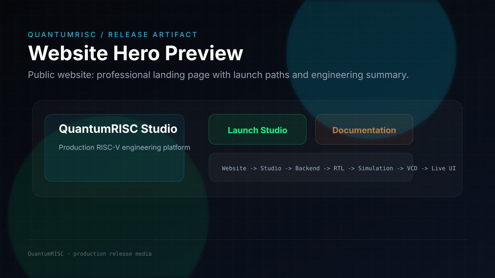

<p align="left">
  
  
  
  
  
  
</p>

## Live Links

| Destination | Link |
|---|---|
| Website | `http://127.0.0.1:8000/` |
| QuantumRISC Studio | `http://127.0.0.1:8000/studio` |
| Documentation | `http://127.0.0.1:8000/docs` |
| GitHub Discussions | `https://github.com/IamChandu114/QuantumRISC` |
| Medium Engineering Series | `https://medium.com/@ca4443700` |

## Executive Summary

QuantumRISC is a fully integrated CPU engineering platform built around a real SystemVerilog RISC-V implementation, a FastAPI simulation backend, and two separate front ends:

- a public professional website that presents the project,
- a live QuantumRISC Studio that drives RTL compilation, simulation, waveform parsing, and architectural visualization,
- and a production documentation portal served at `/docs` and `/documentation`.

The platform exists to make CPU design visible end-to-end. Instead of leaving RTL, verification, and waveforms scattered across tools, QuantumRISC connects them into one coherent engineering workflow. That makes it useful for hardware interviews, portfolio demonstrations, technical presentations, and future RTL development.

## Production Links

- Launch the public website from the repository root route: [`/`](http://127.0.0.1:8000/)
- Open the engineering studio: [`/studio`](http://127.0.0.1:8000/studio)
- Read the official documentation portal: [`/docs`](http://127.0.0.1:8000/docs)
- Alternate documentation route: [`/documentation`](http://127.0.0.1:8000/documentation)

## Feature Highlights

| Area | What it provides |
|---|---|
| RV32IMAC architecture | Real RISC-V CPU implementation with ISA-level coverage |
| 5-stage pipeline | Instruction fetch, decode, execute, memory, and writeback stages |
| Hazard detection | RAW and pipeline hazard tracking with live visibility |
| Forwarding network | Bypass and forwarding analysis for dependent instructions |
| Branch handling | Branch and control-flow visualization |
| RTL verification | SystemVerilog testbenches, simulation runs, and waveforms |
| FastAPI backend | Session control, discovery, compile/run orchestration, and APIs |
| WebSocket streaming | Live simulation state pushed to the Studio |
| VCD parsing | Signal timeline parsing for waveforms and architectural state |
| Engineering dashboard | Registers, memory, pipeline, hazards, and performance panels |
| Documentation portal | Full public documentation site under `/docs` |
| Deployment-ready layout | Clean separation of website, studio, backend, RTL, and verification |

## Architecture Overview

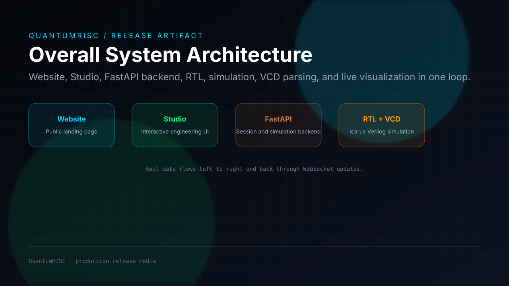
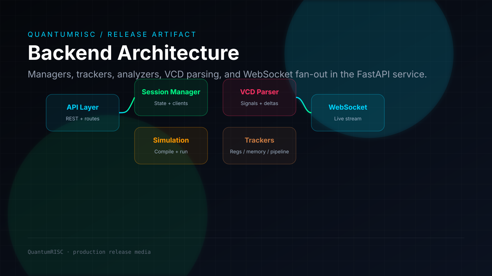
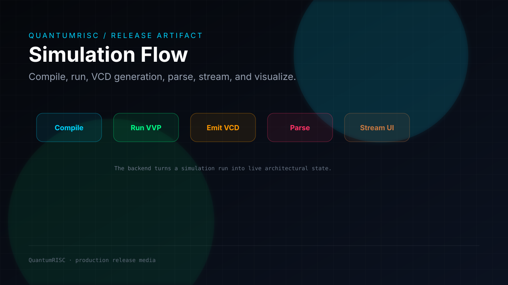
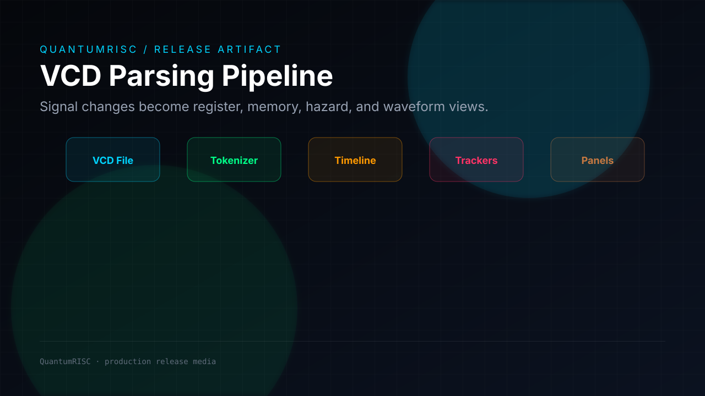
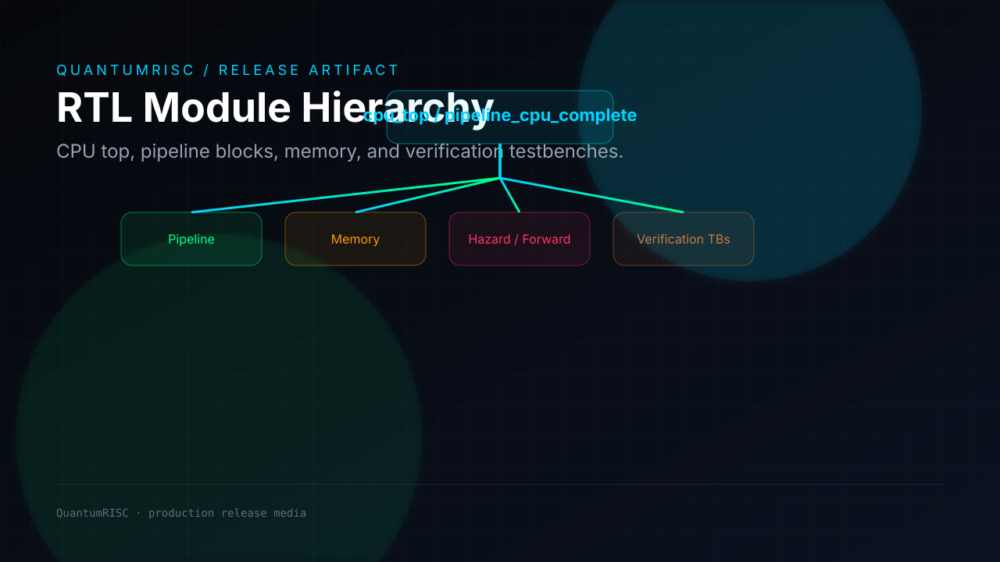
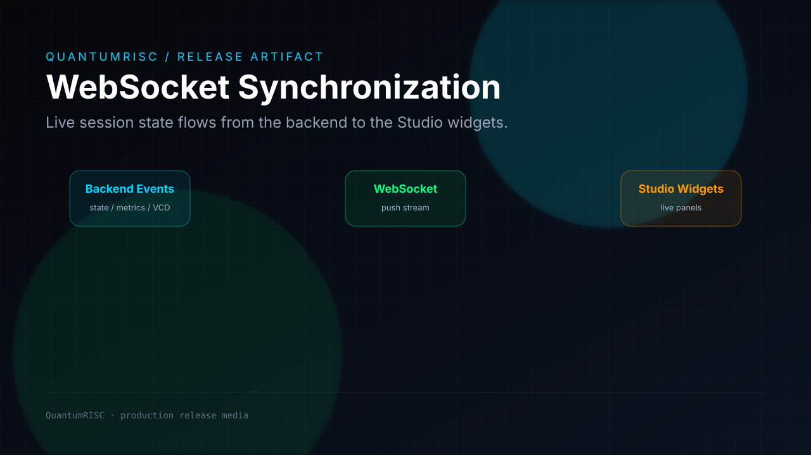
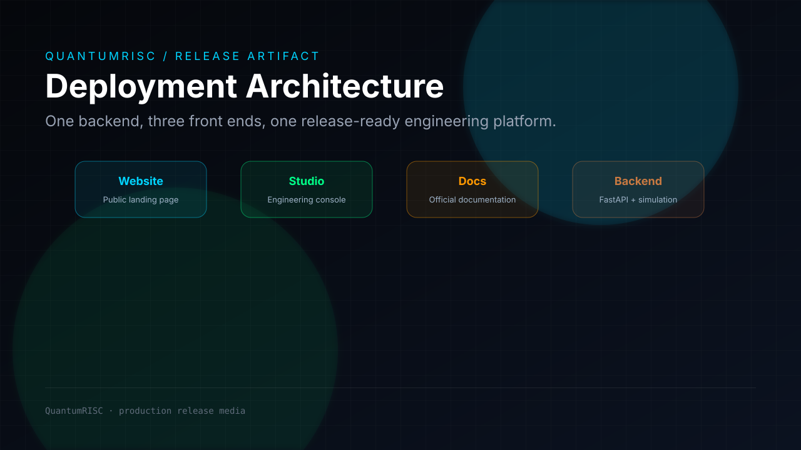
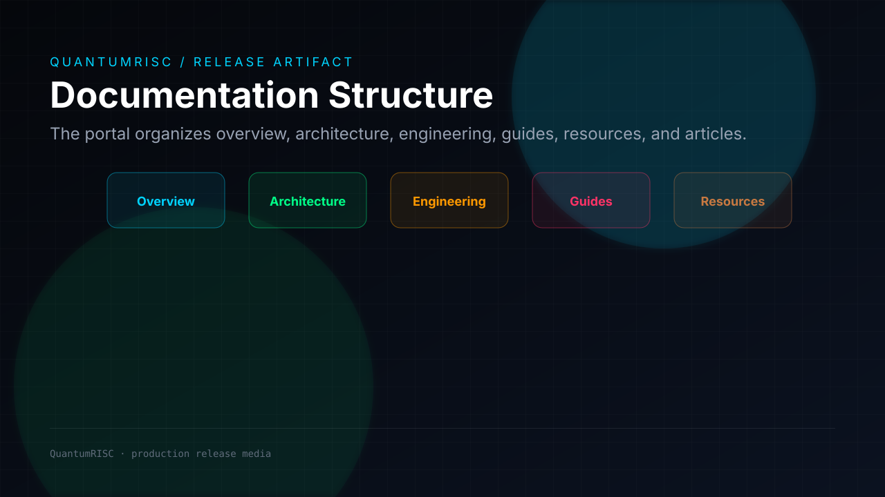

## Visual Gallery


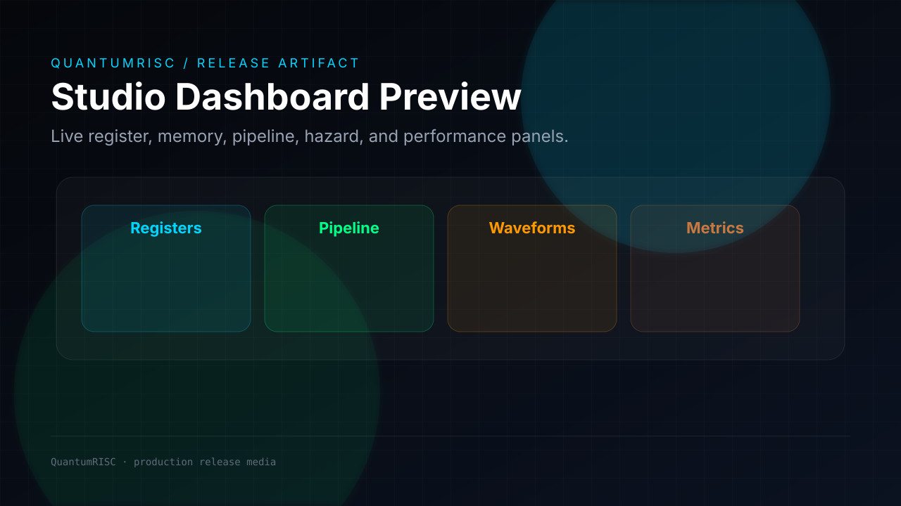
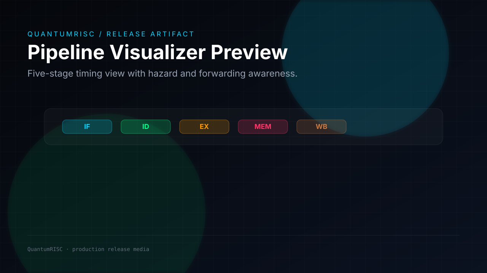
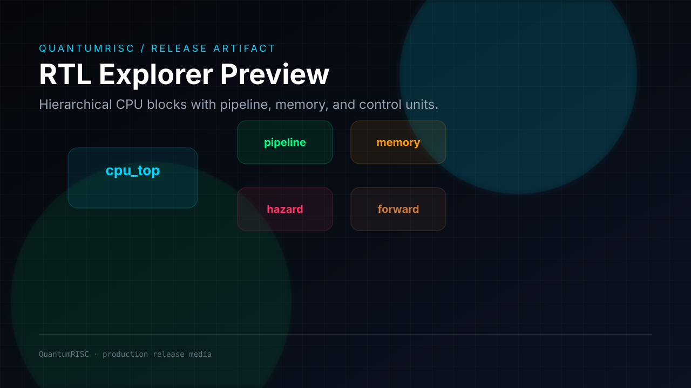
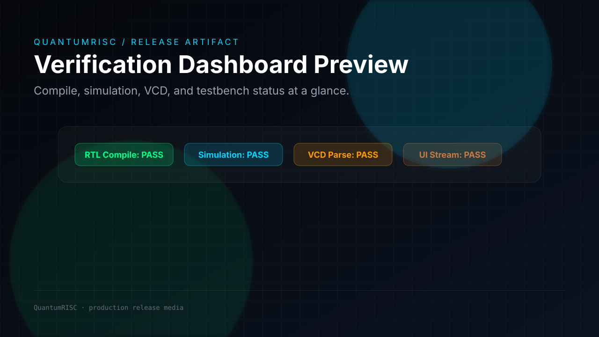
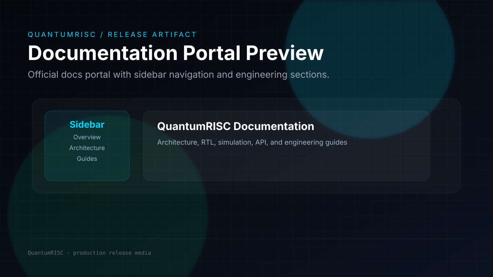

## Demo Preview

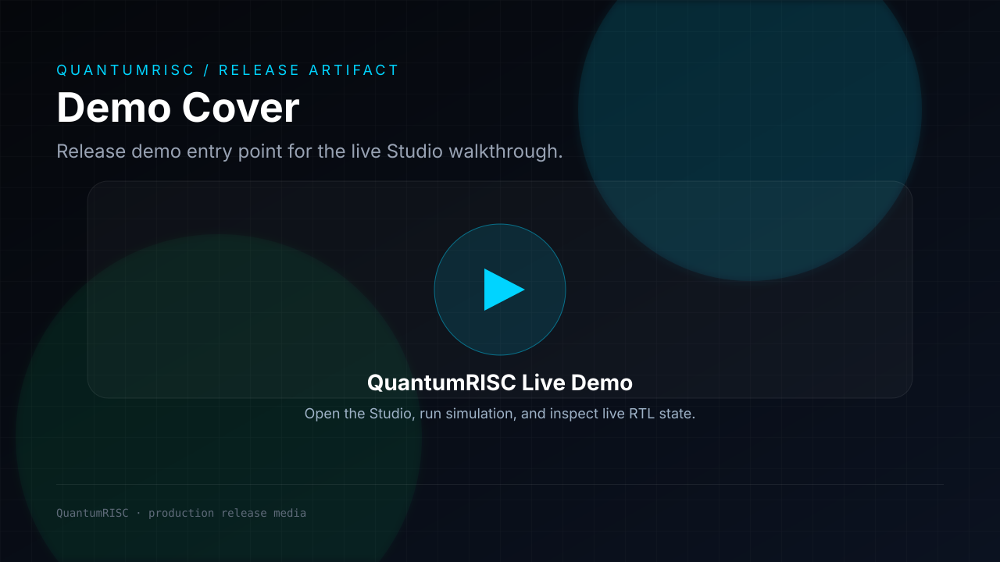

The public release is centered on the live Studio experience:

1. Open the website.
2. Launch QuantumRISC Studio.
3. Start the backend simulation.
4. Observe real register, pipeline, waveform, hazard, and performance data.
5. Use the documentation portal for the architecture and engineering story.

## Engineering Architecture

### Frontend

- `frontend/website/` is the public showcase.
- `frontend/studio/` is the live engineering application.
- `frontend/docs/` is the official documentation portal.

### Backend

- `backend/app/main.py` mounts the website, Studio, and docs portal.
- `backend/app/api/` exposes the REST API.
- `backend/app/sim/` compiles, runs, and manages simulation sessions.
- `backend/app/vcd/` parses waveform data.
- `backend/app/trackers/` derives register, memory, pipeline, and performance state.
- `backend/app/analyzers/` computes hazard and forwarding insights.
- `backend/app/websocket/` streams live updates to the UI.

### RTL

- `rtl/cpu/` contains the CPU core and pipeline logic.
- `rtl/memory/` contains memory-side modules.
- `rtl/pipeline/` contains pipeline registers and control logic.
- `verification/tb/` contains the SystemVerilog testbenches.

### Verification

- The backend automatically discovers RTL and testbenches.
- Icarus Verilog compiles the selected top and verification entry.
- `vvp` runs the simulation and generates VCD output.
- The VCD is parsed into live state snapshots and deltas.

### Documentation

- The official docs portal is served at `/docs` and `/documentation`.
- The footer Documentation button in the website opens the portal in a new tab.
- The docs portal contains the overview, architecture, engineering, guides, resources, and article sections.

### Deployment

- One backend process serves the website, studio, and docs routes.
- The Studio launches the simulation session and consumes live backend data.
- The public site stays separate from the engineering application.
- Fully containerized via Docker for seamless cloud deployments (e.g., Railway, Render).
- Verified continuously by GitHub Actions for code hygiene and frontend build stability.

## Repository Structure

```text
QuantumRISC/
  backend/                FastAPI backend, simulation managers, VCD parsing, trackers, analyzers
  frontend/
    website/              Public showcase website
    studio/               Live QuantumRISC Studio
    docs/                 Official documentation portal
  rtl/                    SystemVerilog CPU implementation
  verification/           SystemVerilog testbenches
  scripts/                Smoke tests and automation
  reports/                Verification and build reports
  waveforms/              Waveform artifacts and traces
  runs/                   Generated simulation runs
  fpga/                   FPGA-related artifacts and notes
  software/               Software support assets
  assets/                 Release diagrams, screenshots, and media
  docs/                   Long-form project guides
```

## Engineering Validation

| Check | Status | Notes |
|---|---:|---|
| RTL compilation | Pass | Icarus Verilog flow is wired through the backend |
| Simulation | Pass | `vvp` execution and session control are implemented |
| VCD generation | Pass | Simulation artifacts are written to run directories |
| VCD parsing | Pass | Backend parses waveform transitions for live UI state |
| Backend APIs | Pass | Discovery, sessions, compile, run, snapshot, and VCD endpoints exist |
| WebSocket | Pass | Live event stream powers the Studio |
| Studio integration | Pass | Live panels consume backend session state |
| Website integration | Pass | Public site launches Studio and links to docs |
| Documentation portal | Pass | Served at `/docs` and `/documentation` |
| Deployment validation | Pass | Single backend serves the integrated experience |

## Performance Metrics

| Metric | Release view |
|---|---|
| Peak IPC | Backend-dependent live telemetry |
| Target synthesis frequency | Unavailable unless emitted by backend synthesis reports |
| Branch prediction accuracy | Unavailable unless emitted by backend branch telemetry |
| Unified L2 cache | Unavailable unless emitted by backend cache telemetry |
| Demo runtime | Session-dependent live run duration |
| Pipeline depth | 5 stages |
| Waveform source | Real VCD traces |
| Parser scope | Registers, memory, pipeline, hazards, forwarding, performance, snapshot state |

## Documentation Portal

The official portal is part of the repository and should be treated as product documentation:

- User guide: `/docs/guides`
- Developer guide: `/docs/guides/developer`
- Architecture guide: `/docs/architecture`
- API reference: `/docs/guides/api`
- Verification guide: `/docs/engineering`
- FPGA guide: `/docs/engineering-journey`
- Engineering journey: `/docs/engineering-journey`
- Troubleshooting: `/docs/resources/faq`

## Medium Engineering Series

| Preview | Article |
|---|---|
| 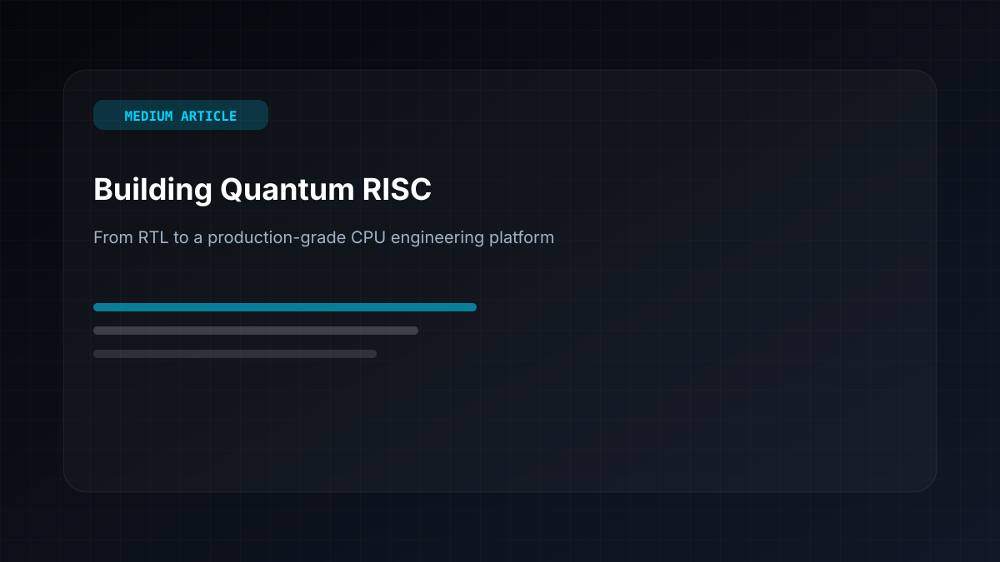 | [Building Quantum RISC: From RTL to a Production-Grade CPU Engineering Platform](https://medium.com/@ca4443700/building-quantum-risc-from-rtl-to-a-production-grade-cpu-engineering-platform-fe10dbe31326) |
| 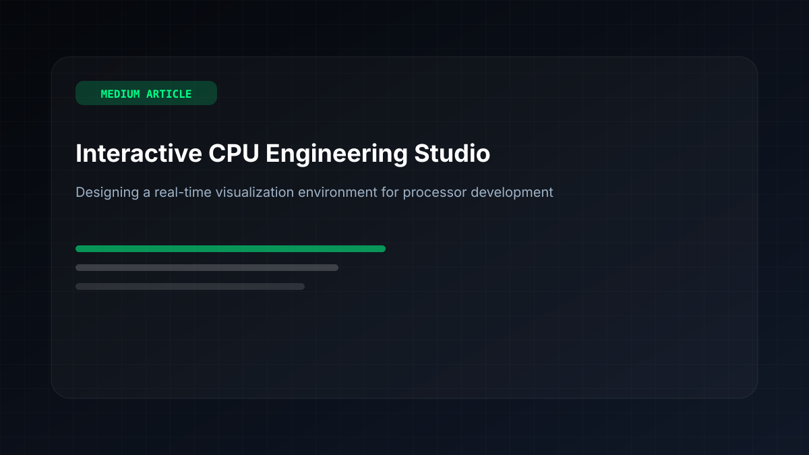 | [Building an Interactive CPU Engineering Studio: Designing a Real-Time Visualization Environment for Processor Development](https://medium.com/@ca4443700/building-an-interactive-cpu-engineering-studio-designing-a-real-time-visualization-environment-for-362363a68d74?sharedUserId=ca4443700) |
| 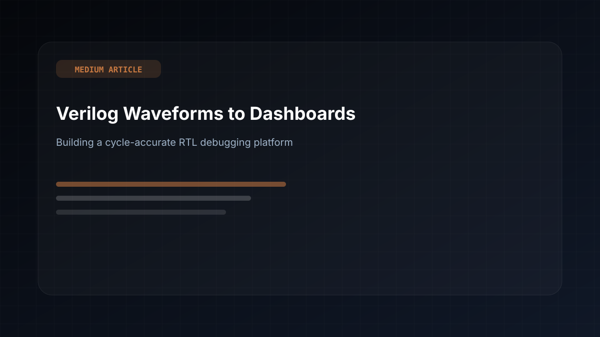 | [From Verilog Waveforms to Interactive Engineering Dashboards: Building a Cycle-Accurate RTL Debugging Platform](https://medium.com/@ca4443700/from-verilog-waveforms-to-interactive-engineering-dashboards-building-a-cycle-accurate-rtl-cd09b03ccb48?sharedUserId=ca4443700) |

## Suggested GitHub Topics

`risc-v`, `computer-architecture`, `verilog`, `systemverilog`, `cpu`, `processor`, `rtl`, `verification`, `fastapi`, `websockets`, `fpga`, `engineering`

## Release Checklist

- Website opens at `/`
- Studio opens at `/studio`
- Documentation opens at `/docs`
- Alternate docs route works at `/documentation`
- Footer Documentation button launches the docs portal in a new tab
- README diagrams render on GitHub
- Release media is grouped under `assets/`
- Build artifacts are excluded from the release narrative

## License

MIT
